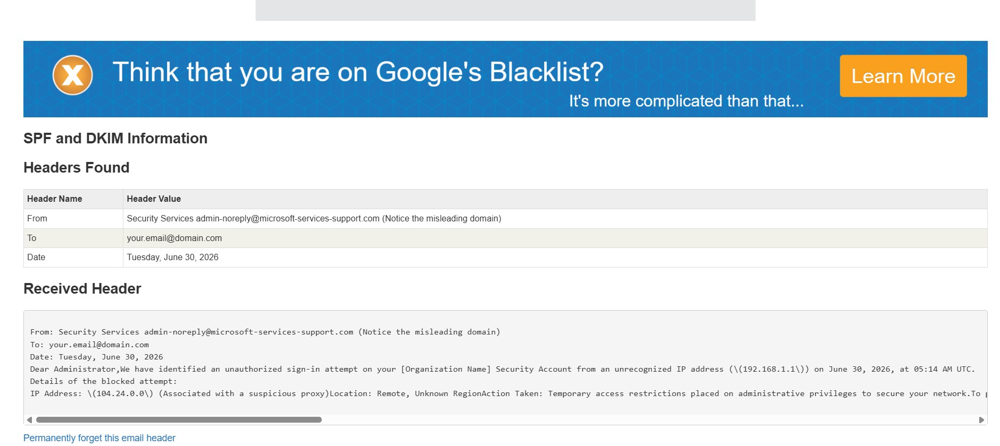

# Task-2-Phishing-Email-Analysis

## Objective
Analyze a phishing email using MXToolbox Email Header Analyzer and identify phishing indicators.

## Tools Used
- MXToolbox Email Header Analyzer
- KnowBe4 Phishing Security Test
- GitHub

## Phishing Indicators Found
- Misleading sender domain
- Suspicious sender email address
- Urgent security warning
- Request for immediate action
- Unknown IP address
- Fake Microsoft support domain

## MXToolbox Analysis Screenshot

## Conclusion

The analyzed email is a phishing email because it uses a misleading sender domain, creates urgency, and attempts to trick users into revealing sensitive information.
